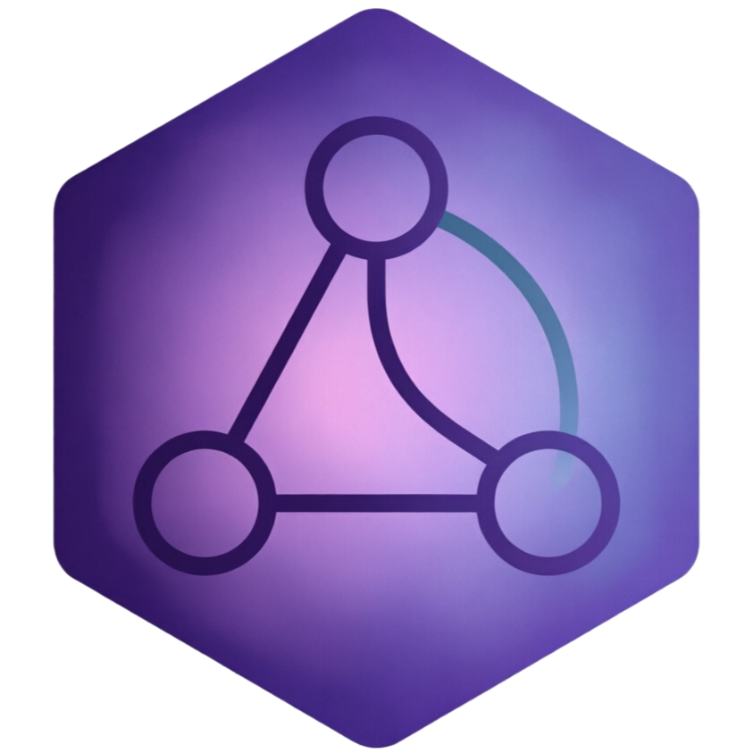

<p align="center">
  
</p>

<h1 align="center">glyph-mi 2.7</h1>

<p align="center">
  <strong>Glyph Metadata Intelligence</strong><br>
  Universal analysis core with product modules
</p>

<p align="center">
  <a href="https://krwg.github.io/glyph-mi/">Site</a> ·
  <a href="GUIDE.ru.md">GUIDE.ru</a> ·
  <a href="https://github.com/FlokeStudio/glyph-miO">glyph-miO</a> ·
  <a href="https://github.com/FlokeStudio/glyph-s">glyph-s</a>
</p>

---

## User section

### What is glyph-mi?

**glyph-mi** is the **metadata intelligence core** of the Glyph family. It analyzes content — music tracks, notes, documents — and returns structured metadata: suggested tags, confidence scores, spectral features, and contextual hints.

In 2.7, glyph-mi evolves from a Senza-specific pipeline into a **universal core** with pluggable product modules. Senza behavior is preserved; new products (like Cultiva) can plug in without forking the codebase.

### Who is this for?

| Audience | What you need |
|----------|---------------|
| **Senza users** | glyph-mi runs inside Senza automatically — tags, metadata, spectral analysis |
| **Obsidian users** | Install [**glyph-miO**](https://github.com/FlokeStudio/glyph-miO) instead — lighter, note-focused |
| **Developers** | Use `analyzeUniversal()` to integrate MI into your own product |

### What’s new in 2.7

**Universal contracts** (`js/universal/contracts.js`):

- `normalizeInput(input)` — canonical input shape: `track`, `context`, `moduleId`
- `normalizeResult(base)` — canonical output: `fields`, `confidence`, `sources`, `hints`
- `GLYPH_MI_API_VERSION = '2.7.0'` — versioned API surface

**Module routing** (`js/universal/engine.js`):

```js
import { analyzeUniversal, listGlyphModules } from './js/index.js';

const result = await analyzeUniversal(
  { track: { path: '/music/track.flac', title: 'Song' }, context: { app: 'senza' } },
  { moduleId: 'senza' }
);
```

**Product modules:**

| Module | Status | Product | Capabilities |
|--------|--------|---------|--------------|
| `senza` | **Active** | Senza music library | tags, metadata, spectral, kNN, local-agent |
| `cultiva` | Foundation | Cultiva (future) | scaffold — manifest + handler stub |

**Senza adapter** — wraps the existing `analyzeTrackFull()` pipeline through universal contracts. Zero breaking changes for Senza integrations.

**Cultiva foundation** — scaffold module with manifest, placeholder handler, and knowledge pack at `knowledge/public/cultiva-foundation-v1.json`. Ready for future product wiring.

**Module introspection:**

```js
import { listGlyphModules, resolveGlyphModule } from './js/index.js';

listGlyphModules();
// [{ moduleId: 'senza', label: 'Senza Module', capabilities: [...] }, ...]

resolveGlyphModule('senza');
// { moduleId, label, enabledByDefault, capabilities, product }
```

### How analysis works (Senza module)

1. **Input normalization** — track path, title, artist, album, genre, glyph features
2. **Pipeline execution** — spectral analysis, kNN neighbor lookup, tag propagation
3. **Result normalization** — confidence score, field map, source attribution, hints
4. **Fallback** — unknown `moduleId` routes to default analyzer with `hints.fallback` note

### Python CLI

For batch analysis and scripting:

```bash
pip install -e ".[spectral]"
glyph-mi analyze --help
```

The Python package shares the same analysis logic and supports spectral feature extraction when the `[spectral]` extra is installed.

### Pair with glyph-s

| glyph-s | glyph-mi |
|---------|----------|
| Finds content across your library | Understands individual items |
| Full-text search, ranking, snippets | Tags, metadata, spectral features |
| [glyph-sO](https://github.com/FlokeStudio/glyph-sO) for Obsidian | [glyph-miO](https://github.com/FlokeStudio/glyph-miO) for Obsidian |

Together they form the complete Glyph intelligence stack.

---

## GitHub / Dev section

### Architecture

```
js/
  universal/
    contracts.js          # normalizeInput, normalizeResult, API version
    engine.js             # analyzeUniversal, listGlyphModules, module routing
  modules/
    senza/
      index.js            # analyzeForSenza, SENZA_MODULE_MANIFEST
    cultiva/
      index.js            # analyzeForCultivaFoundation (scaffold)
      manifest.json
  providers/
    mi.js                 # default analyzeMI fallback
  pipeline.js             # Senza full analysis pipeline
  index.js                # public exports
knowledge/
  public/
    cultiva-foundation-v1.json   # Cultiva knowledge pack placeholder
```

### Module registry

Modules are registered in `js/universal/engine.js`:

```js
const MODULE_HANDLERS = {
  senza: analyzeForSenza,
  cultiva: analyzeForCultivaFoundation,
};

const MODULE_MANIFESTS = {
  senza: SENZA_MODULE_MANIFEST,
  cultiva: CULTIVA_MODULE_MANIFEST,
};
```

To add a new product module:

1. Create `js/modules/<product>/index.js` with handler + manifest
2. Register in `MODULE_HANDLERS` and `MODULE_MANIFESTS`
3. Implement `normalizeInput` → analysis → `normalizeResult` flow

### Input contract

```js
{
  moduleId: 'senza',           // optional, default 'senza'
  track: {
    id, path, title, artist, album, genre, year, trackNo,
    glyphFeatures,             // spectral / glyph data
  },
  context: {
    folderHint, siblingTracks, tags, app,
  },
}
```

### Result contract

```js
{
  apiVersion: '2.7.0',
  moduleId: 'senza',
  provider: 'glyph-mi',
  fields: { /* product-specific metadata */ },
  confidence: { score: 0.85, reasons: ['spectral match', 'kNN neighbor'] },
  sources: [/* attribution */],
  hints: { /* optional guidance */ },
}
```

### Install (development)

```bash
git clone https://github.com/krwg/glyph-mi.git
cd glyph-mi

# JavaScript (no build step — ESM source)
node -e "import('./js/index.js').then(m => console.log(m.listGlyphModules()))"

# Python
pip install -e ".[spectral]"
```

### Project layout

| Path | Role |
|------|------|
| `js/universal/contracts.js` | API version, input/output normalization |
| `js/universal/engine.js` | Universal entry, module routing, fallback |
| `js/modules/senza/` | Senza adapter (active) |
| `js/modules/cultiva/` | Cultiva foundation (scaffold) |
| `js/pipeline.js` | Senza analysis pipeline |
| `knowledge/public/` | Knowledge packs for modules |
| `pyproject.toml` | Python package metadata (v2.7.0) |
| `docs/index.html` | GitHub Pages landing |

### Related repositories

| Repo | Role |
|------|------|
| [glyph-miO](https://github.com/FlokeStudio/glyph-miO) | Obsidian plugin (extractive summaries + tags) |
| [glyph-s](https://github.com/FlokeStudio/glyph-s) | Shared search engine |
| [glyph-sO](https://github.com/FlokeStudio/glyph-sO) | Obsidian search plugin |

### License

GPL-3.0-or-later · krwg
